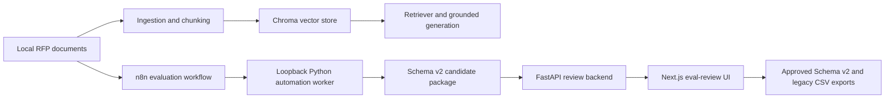

# Architecture

BidMate is split into three independently runnable surfaces that share versioned contracts rather than runtime databases.

## RAG runtime

The Python package under `src/bidmate_rag` owns parsing, cleaning, chunking, metadata normalization, embeddings, Chroma storage, hybrid retrieval, grounded answer generation, evaluation, and cost tracking. Providers are selected through YAML configuration. The public demo registers `deterministic-demo`, which exercises the real indexing and retrieval pipeline without a network call or API key.

## Evaluation generation

The three workflow definitions in `n8n/workflows` are orchestration only. They call a versioned FastAPI worker on loopback, while the worker owns inventory, work-unit planning, retry state, evidence resolution, Schema v2 validation, checksums, and package writing. SQLite is a runtime ledger under ignored `artifacts/`; it is never a source artifact.

## Review and export

The review backend persists drafts, revisions, decisions, forks, sessions, audit events, and exports in a local SQLite database. The Next.js `/eval-review` UI provides package discovery, structured editing, PDF.js TextLayer evidence selection, approval and rejection controls, conflict handling, and export. Approved data can be emitted as the canonical Schema v2 package and as the existing 11-column Judge-compatible CSV format.

## Trust boundaries

- Source documents, parsed text, databases, exports, model caches, and generated PDFs stay in ignored local paths.
- n8n workflows contain no credentials, webhook triggers, or non-loopback service URLs.
- Real-model execution is optional and separate from the deterministic public demo.
- The publication guard scans both the worktree and every reachable Git blob for forbidden document signatures, secrets, PII, large files, and prompt-count drift.
